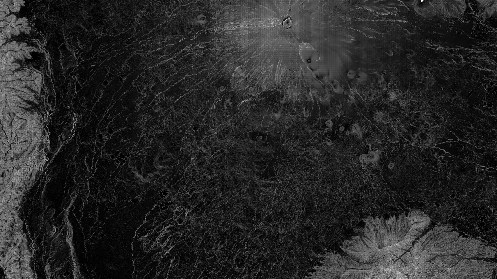
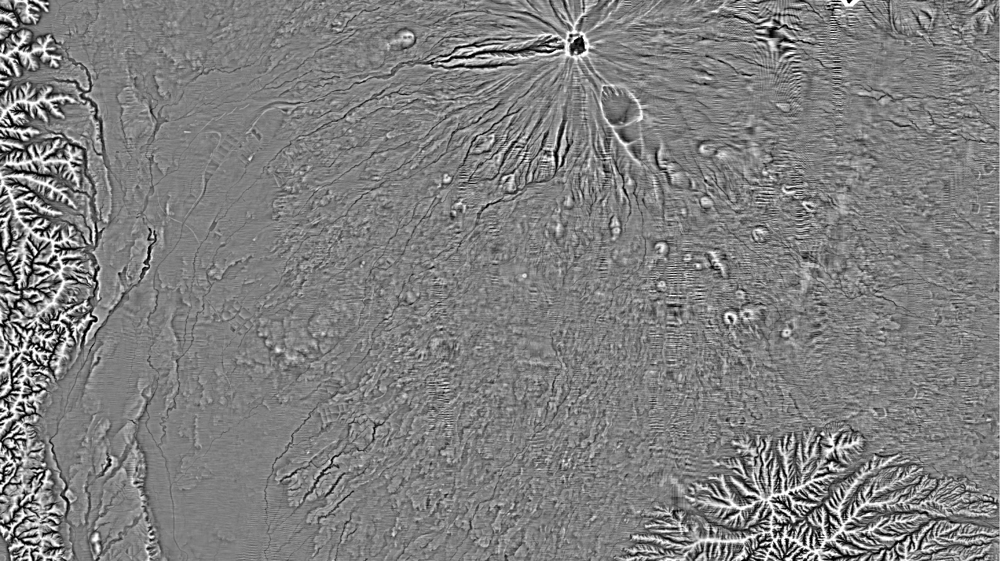
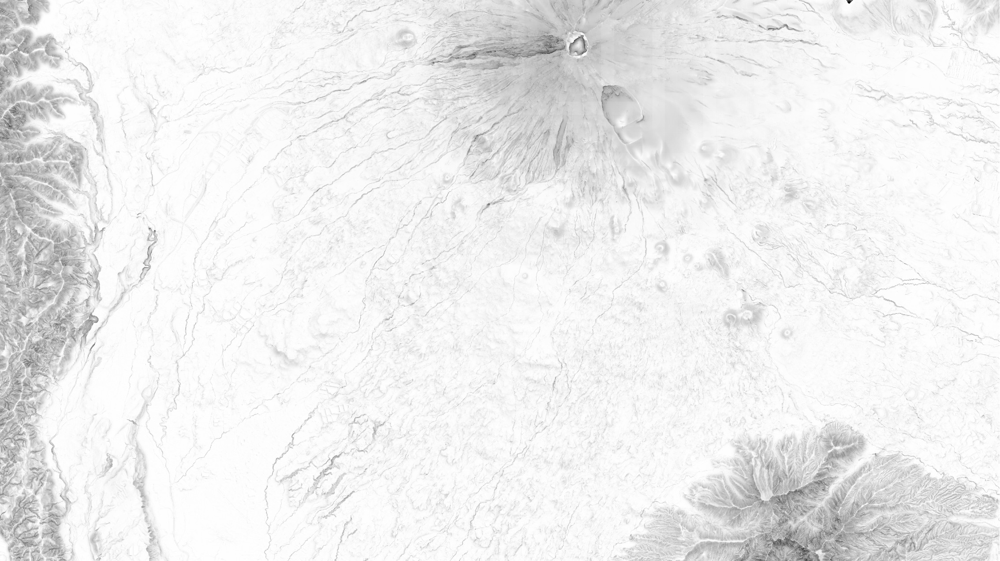
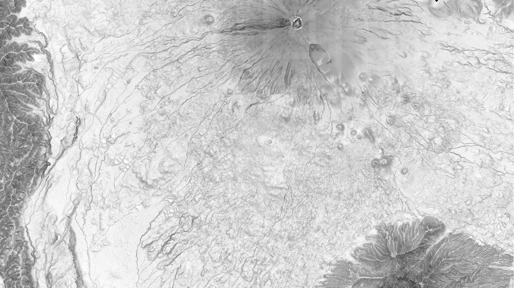
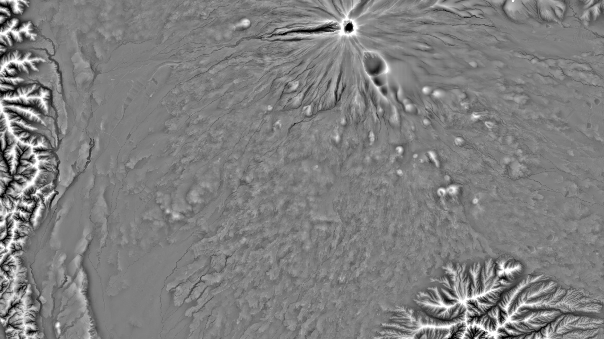
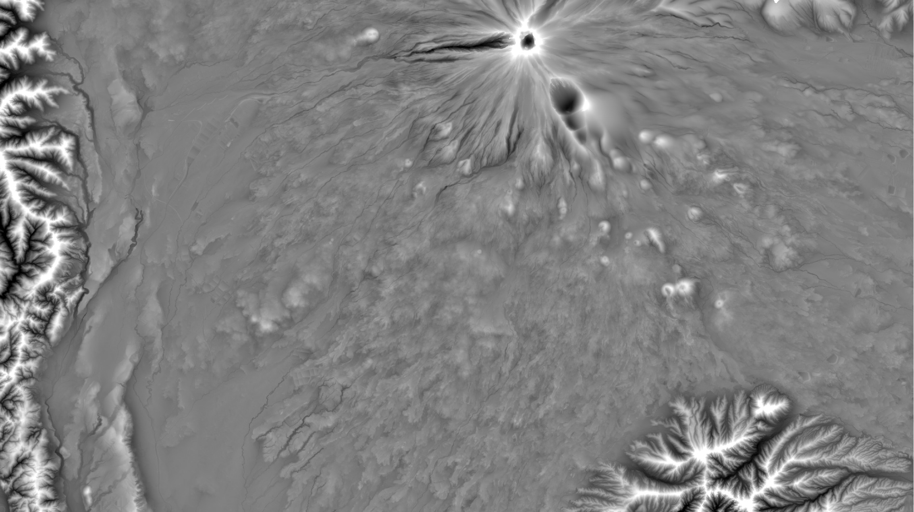
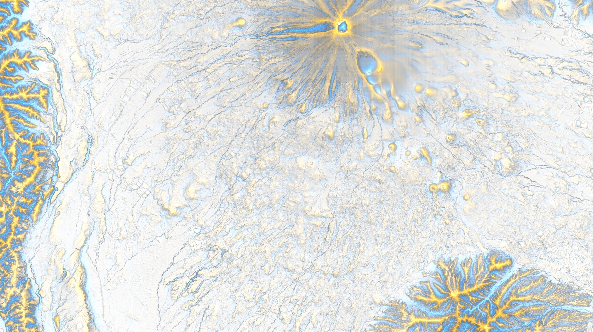

# FujiShader 【富士シェーダー🌋】
Advanced DEM visualization library.
- Capable to process COG (Cloud Optimized GeoTIFF) directly.
- Some original cool shading methods

***!!! Currently in ALPHA !!!***

## Installation
```bash
pip install git+https://github.com/geoign/FujiShader.git
```

The development of a QGIS plugin is in progress.

## Shaders
Note that none of them are compatible to LatLon Grid... yet.

### Slope

Classic slope map. Very fast.
```bash
FujiShader DEM.tif SLOPE.tif --algo slope
```
    Optional arguments:
    --set-nan None (Replace certain value with NaN)
    --replace-nan None (Replace NaN with certain value)
    --cellsize 1.0 (meter/pixel)
    --unit degrees (or percent)

### Topographic Position Index

Classic TPI map. Not very fast.
```bash
FujiShader DEM.tif TPI.tif --algo tpi
```
    Optional arguments:
    --set-nan None (Replace certain value with NaN)
    --replace-nan None (Replace NaN with certain value)
    --cellsize 1.0 (meter/pixel)
    --radius_m 100.0 (meters)
    
### SkyView Factor

Classic skyview factor. Very slow.
```bash
FujiShader DEM.tif SVF.tif --algo skyview_factor
```
    Optional arguments:
    --set-nan None (Replace certain value with NaN)
    --replace-nan None (Replace NaN with certain value)
    --cellsize 1.0 (meter/pixel)
    --max_radius 100.0 (= 100 meters)
    --n_directions 16 (= 16 directions)
    --tile_size None (Use 1024 or so for COG)
    --memory_efficient: False (Usually don't need)

### SkyView Factor Fast

Pseudo SVF. Not based on the original implementation. Slightly faster.
```bash
FujiShader DEM.tif SVF.tif --algo skyview_factor_fast
```
    Optional arguments:
    --set-nan None (Replace certain value with NaN)
    --replace-nan None (Replace NaN with certain value)
    --cellsize 1.0 (meter/pixel)
    --max_radius 100.0 (= 100 meters)
    --n_directions 16 (= 16 directions)
    --n_samples 8 (Reduced sampling steps)
    --tile_size None (Use 1024 or so for COG)

### Curvature

Classic curvature map. Very fast.
```bash
FujiShader DEM.tif CURVATURE.tif --algo profile_curvature
FujiShader DEM.tif CURVATURE.tif --algo plan_curvature
FujiShader DEM.tif CURVATURE.tif --algo total_curvature
```
    Optional arguments:
    --set-nan None (Replace certain value with NaN)
    --replace-nan None (Replace NaN with certain value)
    --cellsize 1.0 (meter/pixel)

### Openness

Classic openness map based on Yokoyama et al. (2002). Very slow.
```bash
FujiShader DEM.tif CURVATURE.tif --algo positive_openness
FujiShader DEM.tif CURVATURE.tif --algo negative_openness
```
    Optional arguments:
    --set-nan None (Replace certain value with NaN)
    --replace-nan None (Replace NaN with certain value)
    --cellsize 1.0 (meter/pixel)
    --max_radius 100.0 (= 100 meters)
    --n_directions 16 (= 16 directions)

### RidgeVolley - Integral method

Highlights ridges and shadows volleys. Fastest implementation by myself.
```bash
FujiShader DEM.tif RV.tif --algo multi_scale_integral
```
    Optional arguments:
    --set-nan None (Replace certain value with NaN)
    --replace-nan None (Replace NaN with certain value)
    --radii 4,16,64,256 (pixels range)
    --normalize True (Normalize to -1 ~ +1)

### RidgeVolley - BoxGauss method

Highlights ridges and shadows volleys. Faster implementation by myself.
```bash
FujiShader DEM.tif RV.tif --algo multi_scale_boxgauss
```
    Optional arguments:
    --set-nan None (Replace certain value with NaN)
    --replace-nan None (Replace NaN with certain value)
    --radii 4,16,64,256 (pixels range)
    --normalize True (Normalize to -1 ~ +1)

### RidgeVolley - TopoUSM method

Highlights ridges and shadows volleys. "Slower for quality" implementation by myself.
```bash
FujiShader DEM.tif RV.tif --algo multi_scale_usm
```
    Optional arguments:
    --set-nan None (Replace certain value with NaN)
    --replace-nan None (Replace NaN with certain value)
    --radii 4,16,64,256 (pixels range)
    --normalize True (Normalize to -1 ~ +1)
    
### WarmCool Map

Original shading method by myself based on vision science.
```bash
FujiShader RV.tif WARMCOOL.tif --algo warmcool_map --slope SLOPE.tif --svf SVF.tif`
```
    Optional arguments:
    --set-nan None (Replace certain value with NaN)
    --replace-nan None (Replace NaN with certain value)
    --slope_ref 45 (max degrees)
    --slope_weight 0.4 (0~1)
    --svf_weight 0.3 (0~1)
    --warm_gain 0.5 (0~1)
    --cool_gain 0.5 (0~1)

### Ambient Occlusion

Ambient occlusion effect which is common in 3D modeling.
```bash
FujiShader DEM.tif AO.tif --algo ambient_occlusion
```
    Optional arguments:
    --set-nan None (Replace certain value with NaN)
    --replace-nan None (Replace NaN with certain value)
    --cellsize 1.0 (meter/pixel)
    --max_radius 100.0 (= 100 meters)
    --n_rays 64 (directions)
    --stride 1 (2 or 4 to speed up)

### Metallic Shading (Specular)

Specular effect by Blinn–Phong method.
```bash
FujiShader DEM.tif MS.tif --algo metallic_shade
```
    Optional arguments:
    --set-nan None (Replace certain value with NaN)
    --replace-nan None (Replace NaN with certain value)
    --cellsize 1.0 (meters/pixel)
    --azimuth_deg 315.0 (degrees)
    --altitude_deg 45.0 (degrees)
    --view_alt_deg 60.0 (degrees)
    --shininess 32
    --specular_strength 0.6 (0~1)
    --gamma 2.2 (Good for sRGB)

### Sunlight

Lambertian hillshade with optional cast shadows.
```bash
FujiShader DEM.tif DL.tif --algo direct_light
```
    Optional arguments:
    --set-nan None (Replace certain value with NaN)
    --replace-nan None (Replace NaN with certain value)
    --cellsize 1.0 (meter/pixel)
    --azimuth_deg 315.0 (degrees)
    --altitude_deg 45.0 (degrees)
    --cast_shadows True

### Skylight

Isotropic skylight.
```bash
FujiShader DEM.tif SL.tif --algo sky_light
```
    Optional arguments:
    --set-nan None (Replace certain value with NaN)
    --replace-nan None (Replace NaN with certain value)
    --cellsize 1.0 (meter/pixel)
    --max_radius 100.0 (meters; Horizon scan distance)
    --n_directions 16 (directions)

### Swiss Shade

Traditional soft shading method by Eduard Imhof.
```bash
FujiShader DEM.tif SS.tif --algo swiss_shade
```
    Optional arguments:
    --set-nan None (Replace certain value with NaN)
    --replace-nan None (Replace NaN with certain value)
    --cellsize 1.0 (meter/pixel)
    --azimuth_deg 315.0 (degrees)
    --altitude_deg 45.0 (degrees)
    --cast_shadows False (Keep it False)
    --max_shadow_radius 100.0 (meters)
    --weight 1.0 (0~1)
    --normalize_by_count True

## Acknowledgements
Thanks to ChatGPT o3 and Claude Sonnet 4.

## Credit
**Fumihiko IKEGAMI** / Ikegami GeoResearch

## License
This project is licensed under the **MIT License**. See the [LICENSE](./LICENSE) file for details.
